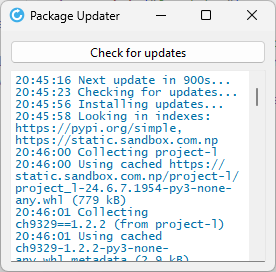

# pkg-updater

A python script to update packages



## Installation

You can install the package via pip:

```bash
pip install pkg-updater
```

## Usage

```
usage: app.py [-h] [--extra-index-url EXTRA_INDEX_URL] [--interval INTERVAL] [--delay-first DELAY_FIRST] package_name

positional arguments:
  package_name

options:
  -h, --help            show this help message and exit
  --extra-index-url EXTRA_INDEX_URL
  --interval INTERVAL
  --delay-first DELAY_FIRST
```

## License

This project is licensed under the terms of the MIT license.
